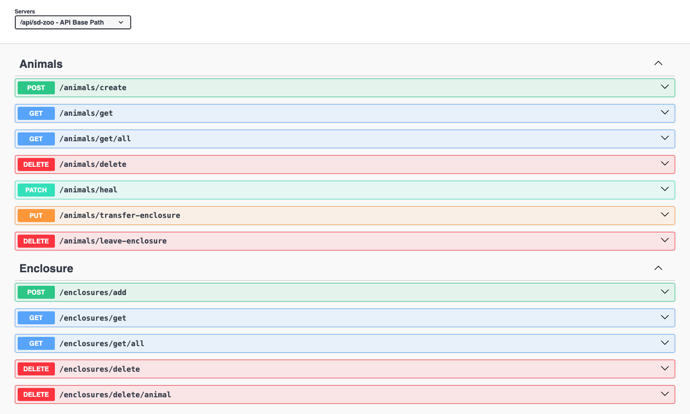
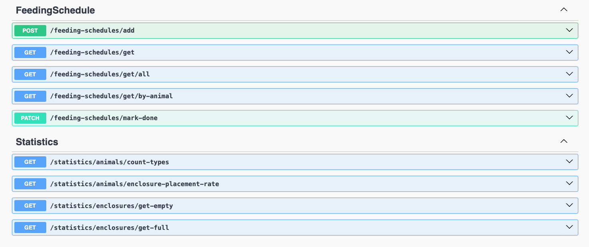

## Software Design || HSE-SE 2 course

**Демченко Георгий Павлович, БПИ-235**

### Boot guidance

#### Change .env.template variables if needed

| **Variable**        | **Description** | **Default** |
|---------------------|--------------|-------------|
| **SD_ZOO_API_PORT** | Port, forwarded to docker container with application | 7070        |
| **BUILD_ARCH**      | Your system / docker builder architecture | arm64       |
| **BUILD_PLATFORM**  | Your system / docker builder OS  | linux/arm64 |

#### Program boot

```shell
cd SD.Mini.ZooManagement/ && touch .env && cp .env.template .env && docker compose up -d
```

### Swagger

Swagger will be available for address:  **http://localhost:{SD_ZOO_API_PORT}/api/sd-zoo/swagger/**

### Implemented functionality

All implemented functionality is reflected in Swagger and self-describable.

All business logic and logic of interaction of domain objects is located in

- **SD.Mini.ZooManagement.Domain**
- **SD.Mini.ZooManagement.Application**

projects, in particular

- **SD.Mini.ZooManagement.Domain.Models/**
- **SD.Mini.ZooManagement.Application.Services/**

|                                 |                                 |
|---------------------------------|---------------------------------|
|  |  |


### Concepts and principles of DDD and Clean Architecture

### Clean Architecture

All business logic of the application is stored in SD.Mini.ZooManagement.Domain and SD.Mini.ZooManagement.Application projects of the solution, isolated from external dependencies.

Infrastructure and API projects depend on contracts defined in Domain and Application projects, and not vice versa. Through defined in Domain and Application project contracts/interfaces dependencies are maintained inside application core.

All application project layers communicate with each other via these specified contracts-interfaces. 

**AnimalsController** (API layer)

 <- **IAnimalTransferService** (Application / Domain layer) -> 
 
 **IAnimalsRepository** ( Infrastructure layer, but defined in appliaction layer - **SD.Mini.ZooManagement.Application/Contracts/Dal** )

Example: interaction of services in the Application layer with the Infrastructure layer occurs via contracts-interfaces of repositories defined in the Application layer, which frees the layer from infrastructure dependencies and allows it to control all interaction logic itself.


### DDD 

Core of application - Domain Models are built according to the Rich Model approach, with the isolation of models from external dependencies and the encapsulation of business rules inside.

Domain models use Value Object as primitives to define a more structured and typified domain area